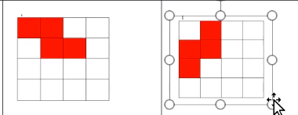

# 
俄罗斯方块

### 1.方块形状
* S型 Z型 L型 J型 O型 T型 I型 （基本其中类型）
* 可以使用4x4的矩阵进行表示
  - S型   
    
  - Z型   
    
  - J型   
    
  - L型   
    
  - O型   
    
  - T型   
    
  - I型   
    

### 2.用代码表示方块
* 用三维数组表示（js/BLOCK_JSON.js）
  
### 3.渲染方块
* 所在文件:（js/block.js）
* 方法：render()
  
### 4.创建地图
* 所在文件:（js/map.js）
  
### 5.方块运动
* 所在文件：（js/block.js）
* 定时任务启动所在文件：（js/game.js）
* 预判断：下一次方块将要到达的位置是否有对应的地图不为0
  
### 6.渲染地图
* 所在文件:（js/block.js）
  
### 7.方块的左、右、下、一键到底移动
* 所在文件:（js/block.js）

### 参考
* https://www.bilibili.com/video/BV1mU4y1p7cp?p=10&spm_id_from=pageDriver